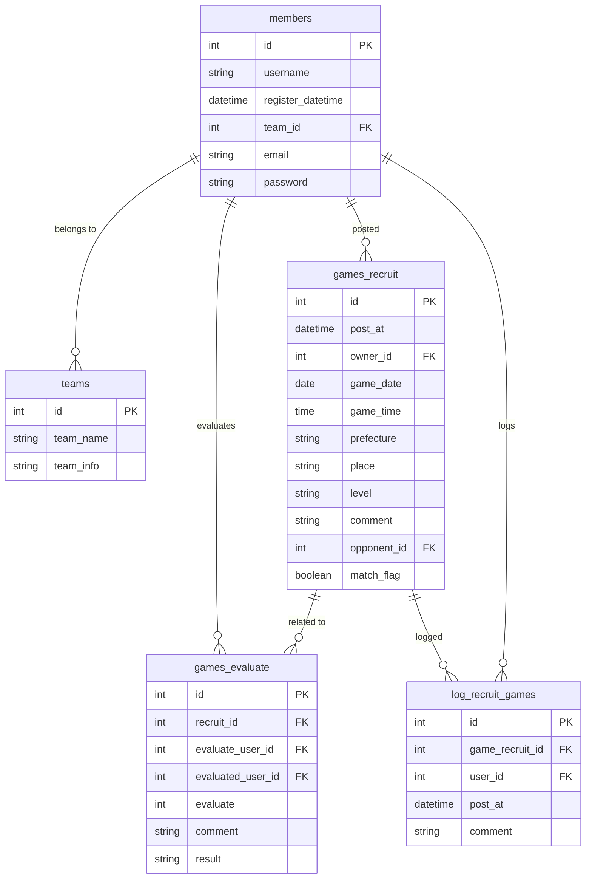

## 対応表

| Front/Backend | Python 環境    |
| ------------- | -------------- |
| yarn          | poetry         |
| package.json  | pyproject.toml |
| node_modgule  | venv           |
| npm           | pip            |
| nodejs        | python         |

## 環境構築

frontend, backend の docker 環境はまだない

```bash
docker-compose -f db/docker-compose.yml up -d
npx create-react-app frontend
```

## Pre-Commit の設定

```bash
yarn install
```



-   [ ] ログイン機能の実装
-   [ ]
