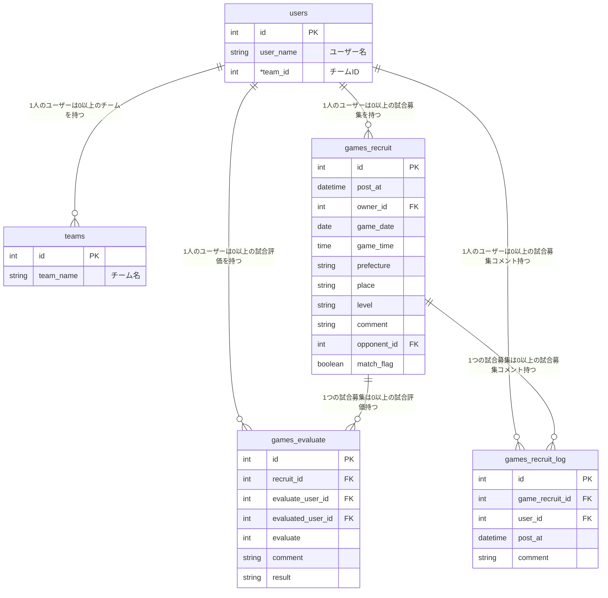

nullable は \*をつける

```mermaid
erDiagram
    users ||--o{ teams : "1人のユーザーは0以上のチームを持つ"
    users ||--o{ games_recruit: "1人のユーザーは0以上の試合募集を持つ"
    users ||--o{ games_evaluate: "1人のユーザーは0以上の試合評価を持つ"
    users ||--o{ games_recruit_log: "1人のユーザーは0以上の試合募集コメント持つ"
    games_recruit ||--o{ games_evaluate: "1つの試合募集は0以上の試合評価持つ"
    games_recruit ||--o{ games_recruit_log: "1つの試合募集は0以上の試合募集コメント持つ"

    users {
        int id PK
        string user_name "ユーザー名"
        int *team_id "チームID"
    }

    teams{
        int id PK
        string team_name "チーム名"
    }

    games_recruit{
        int id PK
        datetime post_at
        int owner_id FK
        date game_date
        time game_time
        string prefecture
        string place
        string level
        string comment
        int opponent_id FK
        boolean match_flag
    }

    games_evaluate {
        int id PK
        int recruit_id FK
        int evaluate_user_id FK
        int evaluated_user_id FK
        int evaluate
        string comment
        string result
    }

    games_recruit_log {
        int id PK
        int game_recruit_id FK
        int user_id FK
        datetime post_at
        string comment
    }
```
